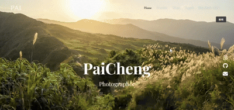

# Photographer Portfolio (MEVN Stack)

這是一個以 MEVN（MongoDB、Express.js、Vue.js、Node.js）為技術基礎所打造的攝影作品集網站，提供攝影師登入、並能夠不透過後台進行上傳及編輯/管理圖片、以及聯絡功能，適合展示個人攝影作品的網頁。

## 目錄

- [技術](#技術)
- [專案畫面截圖](#專案畫面截圖)
- [專案結構](#專案結構)
- [作者資訊](#作者資訊)

## 技術

Frontend: Vue 3 + Vite + Vue Router + Pinia

Styling: TailwindCSS + Vuetify

Backend: Node.js + Express.js

Database: MongoDB (Mongoose ODM)

Auth: Passport.js

Image Cloudbase: Cloudinary

Email: Email.js

## 功能特色

### 使用者功能

- 登入 / 登出

### 攝影作品管理

- 上傳/編輯/刪除任何可見圖片（支援標題、描述、分類等）
- 根據分類篩選不同圖片
- 圖片壓縮與優化（使用 Cloudinary/Browser-image-compression）

### 溝通聯絡功能

- 關於我 : 內容可編輯
- 聯絡表單：可發送郵件至攝影師信箱

## 專案結構

```
photographer-portfolio/
├── server/
│ ├── models/
│ ├── routes/
│ ├── controllers/
│ ├── utils/
│ ├── server.js
│ └── package.json
│
├── client/
│ ├── src/
│ │ ├── apis/
│ │ ├── types/
│ │ ├── utils/
│ │ ├── components/
│ │ ├── assets/
│ │ ├── views/
│ │ ├── stores/
│ │ └── router/
│ ├── vite.config.js
│ └── package.json
│
└── README.md
```

## 專案畫面截圖

### 首頁

#### 輪播圖片

- 圖片順序切換
- 圖片上傳
- 圖片刪除

#### 主題

- 圖片位置調整
- 主題圖片上傳
- 主題圖片刪除
- 主題更名



### 作品集頁面

#### 作品集圖片

- 圖片單張/批量上傳
- 圖片刪除
- 圖片放大檢視
- 封面圖片更換

#### 合輯

- 合輯上傳
- 合輯編輯圖片/標題/敘述
- 合輯刪除
- 合輯子圖片上傳/刪除


### 聯絡頁面

#### 聯絡表單

- 表單驗證
- Gmail 聯絡

#### 圖片

- 圖片皆可調整變動

#### 關於我

- 關於我內容可編輯


## LiveSite

- GitHub - [Repository](https://github.com/Benson0721)
- Live Site - [Photographer_portfolio](https://photographer-portfolio-frontend-vercel.vercel.app/)

## 作者資訊

- 作者：Benson
- 前端學習者-以成為一名前端工程師為目標!
- 作品集： [Notion](https://www.notion.so/Front-End-layout-Portfolio-1c4acba779c38053a9dcf4b1caa7af0c)/[Cake](https://www.cake.me/a092468579/portfolios)
- Email：a092468579@gmail.com
